# RNAcentral database functions — call graph vault

This is an [Obsidian](https://obsidian.md) vault documenting the PL/pgSQL functions
exported under [`database_functions/`](../../database_functions). Open this folder as a
vault (or just browse the Markdown) and use the **graph view** to explore how the
functions call each other.

## How it's organised

- **[[schemas]]** — one note per schema (`release`, `rnc_load_rna`, `rnc_load_xref`, `rnc_update`)
  listing its functions.
- **functions/** — one note per function. Each note records its signature, what it does,
  which functions it **calls** (`[[wikilinks]]`), and which tables it touches.
- **[[external-dependencies]]** — functions that are called but **not present** in
  `database_functions` (schemas you may want to add).

Every `[[link]]` is a call edge, so Obsidian's graph view *is* the call graph.

> **Open work:** see [[follow-ups]] for the release-load performance follow-ups
> (revert_pel fix, accessions mapping, dropping do_checks, optional perf, housekeeping).

## Schemas

- [[rnc_update]] — top-level orchestration of a release load.
- [[rnc_load_rna]] — load new sequences into the `rna` table.
- [[rnc_load_xref]] — full-release xref load via partition exchange.
- [[release]] — release-table query/mutation helpers.

## The main flow (full release load)

```mermaid
flowchart TD
    NUR["rnc_update.new_update_release"] --> MSD["move_staging_data"]
    NUR --> LR["rnc_update.load_release"]

    LR --> LRS["(rnc_logging.log_release_start)"]:::ext
    LR --> LRNA["rnc_load_rna.load_rna"]
    LR --> GRT["release.get_release_type"]
    LR --> GPR["release.get_previous_release"]
    LR -->|type = F| LX["rnc_load_xref.load_xref"]
    LR -->|type = I| LXI["(rnc_load_xref_incremental.load_xref_incremental)"]:::ext
    LR --> MAD["mark_as_done"]
    LR --> LRE["(rnc_logging.log_release_end)"]:::ext

    MAD --> SRS["release.set_release_status"]
    MAD --> SCR["(database.set_current_release)"]:::ext

    LRNA --> lrt["load_retro_tmp_table"]
    LRNA --> lms["load_md5_stats_table"]
    LRNA --> lmc["load_md5_collisions_table"]
    LRNA --> lmn["load_md5_new_sequences_table"]
    LRNA --> scp["set_comparable_prot_upi"]
    LRNA --> sns["store_new_sequences"]
    lmn --> upi["(upi.getUpi)"]:::ext

    LX --> ppt["prepare_pel_tables"]
    LX --> pp1["populate_pel_tables1"]
    LX --> pp2["populate_pel_tables2"]
    LX --> lumv["load_upi_max_versions_table"]
    LX --> lmv["load_max_versions_table"]
    LX --> pp3["populate_pel_tables3"]
    LX --> pp4["populate_pel_tables4"]
    LX --> dpe["do_pel_exchange"]
    LX --> dc["do_checks"]

    classDef ext fill:#fdd,stroke:#c00,stroke-dasharray:5 5;
```

Dashed/red nodes are [[external-dependencies]] — referenced but not defined in this folder.

## Independent entry points

These are not reached from `new_update_release`; they are invoked directly by the
pipeline or run manually:

- [[rnc_update.prepare_releases]] → [[rnc_update.create_release]] — seed the `rnc_release` table.
- [[rnc_update.update_literature_references]] — load `rnc_references` / `rnc_reference_map`.
- [[rnc_update.update_rnc_accessions]] — upsert `rnc_accessions`.
- [[rnc_update.verify_xref_id_not_null]] — backfill null xref ids (only ref'd in a commented line of [[rnc_load_xref.do_checks]]).
- [[rnc_load_xref.revert_pel]] — manual rollback of [[rnc_load_xref.do_pel_exchange]].
- Most [[release]] `get_*` helpers — read-only queries called from application code.
