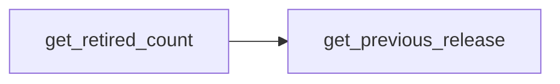

# release

Query and mutation helpers over the `rnc_release` / `rnc_database` / `xref` tables.
Mostly read-only `get_*` functions called from application code; only
[[release.set_release_status]] is reached from the load flow (via [[rnc_update.mark_as_done]]),
and [[release.get_release_type]] / [[release.get_previous_release]] from
[[rnc_update.load_release]]. Part of [[schemas]].

## Functions

- [[release.get_active_count]] — count active xrefs for a db at a release.
- [[release.get_retired_count]] — count xrefs retired in a release (calls [[release.get_previous_release]]).
- [[release.get_checkpoint]] — highest done (`status = 'D'`) release id.
- [[release.get_current_release]] — `rnc_database.current_release` for a db.
- [[release.get_latest_release]] — max release id for a db.
- [[release.get_load_release]] — the non-done (loading) release for a db.
- [[release.get_next_release]] — next release id after a given one.
- [[release.get_previous_release]] — previous release id before a given one.
- [[release.get_release_id]] — release id for a (db, date).
- [[release.get_release_status]] — status of a release (raises if missing).
- [[release.get_release_type]] — type (`F`/`I`/…) of a release (raises if missing).
- [[release.set_release_status]] — update a release's status.

## Internal edges

The rest have no intra-schema calls.
