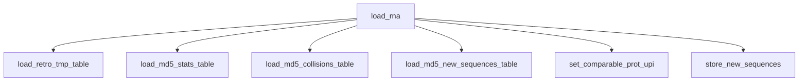

# rnc_load_rna

Loads new sequences from the staging table into the main `rna` table, assigning UPIs.
Driven by [[rnc_load_rna.load_rna]], which is called from [[rnc_update.load_release]].
Part of [[schemas]].

## Functions

- [[rnc_load_rna.load_rna]] — orchestrator; runs the six steps below in order.
- [[rnc_load_rna.load_retro_tmp_table]] — build `load_retro_tmp`, matching staged rows to existing `rna` by md5.
- [[rnc_load_rna.load_md5_stats_table]] — per-md5 counts of distinct sequences (`load_md5_stats`).
- [[rnc_load_rna.load_md5_collisions_table]] — md5s with >1 distinct sequence (`load_md5_collisions`).
- [[rnc_load_rna.load_md5_new_sequences_table]] — allocate UPIs for genuinely new md5s (`load_md5_new_sequences`).
- [[rnc_load_rna.set_comparable_prot_upi]] — fill `comparable_prot_upi` for the new sequences.
- [[rnc_load_rna.store_new_sequences]] — insert new sequences into `rna`.

## Step order

These steps are sequential rather than nested — they communicate through the
`load_retro_tmp`, `load_md5_stats` and `load_md5_new_sequences` working tables.
