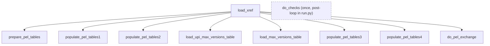

# rnc_load_xref

Full-release (`release_type = 'F'`) xref load. Builds fresh `xref_pel_deleted` /
`xref_pel_not_deleted` tables, then swaps them in as the new `xref` partitions for the
database. Driven by [[rnc_load_xref.load_xref]], called from [[rnc_update.load_release]].
Part of [[schemas]].

The incremental counterpart lives in `rnc_load_xref_incremental` — see [[external-dependencies]].

## Functions

- [[rnc_load_xref.load_xref]] — orchestrator; runs the nine steps below in order.
- [[rnc_load_xref.prepare_pel_tables]] — (re)create the `xref_pel_*` build tables.
- [[rnc_load_xref.populate_pel_tables1]] — retire/keep existing xrefs into pel tables.
- [[rnc_load_xref.populate_pel_tables2]] — bump version_i for changed UPIs.
- [[rnc_load_xref.load_upi_max_versions_table]] — previous max version_i per (ac, dbid), with UPI.
- [[rnc_load_xref.load_max_versions_table]] — collapse to max version_i per (ac, dbid).
- [[rnc_load_xref.populate_pel_tables3]] — insert brand-new / re-appearing xrefs.
- [[rnc_load_xref.populate_pel_tables4]] — write deleted (retired) xrefs.
- [[rnc_load_xref.do_pel_exchange]] — swap pel tables in as live partitions.
- [[rnc_load_xref.do_checks]] — verify PK uniqueness across the whole `xref` table.
  **No longer called per-database** — `release/run.py` runs it once after the loop (2026-06-20).

## Not in the main flow

- [[rnc_load_xref.revert_pel]] — manual rollback of [[rnc_load_xref.do_pel_exchange]] (restores `_old` partitions).

## Order of operations

