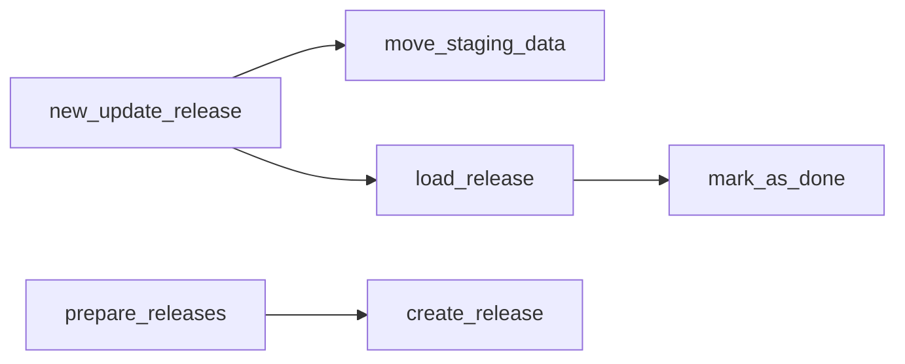

# rnc_update

Top-level orchestration of a release load, plus standalone accession/reference updates.
Part of [[schemas]].

## Release-load orchestration

- [[rnc_update.new_update_release]] — **main entry point**: stage data then load a release.
- [[rnc_update.move_staging_data]] — copy this DB's rows from `load_rnacentral_all` → `load_rnacentral`.
- [[rnc_update.load_release]] — the heart of the load: sequences, xrefs, logging, mark done.
- [[rnc_update.mark_as_done]] — flip release status to `D` and set current release.

## Release setup

- [[rnc_update.prepare_releases]] — create `'L'` releases for each staged database.
- [[rnc_update.create_release]] — insert a single `rnc_release` row.

## Standalone metadata loaders

- [[rnc_update.update_literature_references]] — load `rnc_references` + `rnc_reference_map`.
- [[rnc_update.update_rnc_accessions]] — upsert `rnc_accessions` from `load_rnc_accessions`.
- [[rnc_update.verify_xref_id_not_null]] — backfill null `xref.id` from `xref_pk_seq`.

## Call summary

`load_release` also reaches into [[rnc_load_rna]], [[rnc_load_xref]], [[release]] and
[[external-dependencies]]; see [[rnc_update.load_release]].
